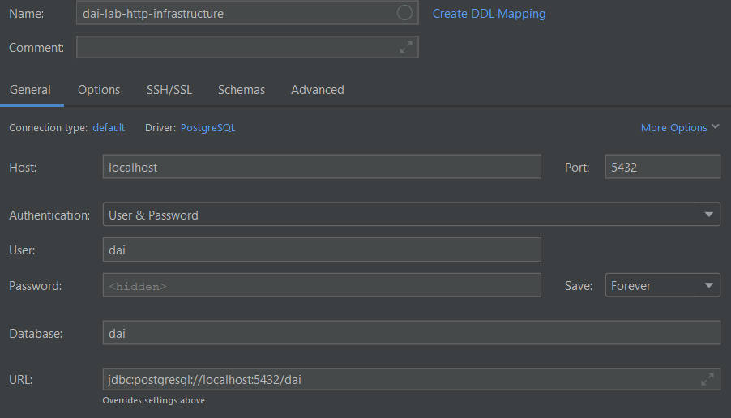
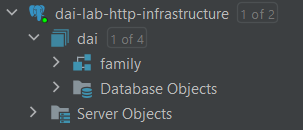

# server-lab-http-infrastructure
Develop a complete infrastructure with static and dynamic Web servers, running on docker-compose

## STEP 1 : 

Commande pour lancer le server static :

Se mettre dans la racine du ficher Dockerfile et lancer la commande suivante :

`docker build -t static-web-server .`

Une fois le build terminé, nous pouvons lancer le server static depuis l'application Docker Desktop, ou alors avec la
commande suivante :

`docker run -p 80:80 web`

## STEP 2 :

Création d'un fichier docker-compose.yml à la racine du serveur static.

Se placer dans le dossier static et lancer la commande suivante :

`docker compose up`

Possibilité de recompiler le docker compose avec la commande suivante :

`docker compose build`

Pour lancer le docker compose en mode détaché / l'éteindre :

`docker compose start`

`docker compose stop`

Ou alors le faire depuis l'application Docker Desktop.

## STEP 3 :

#### Création de la base de données

Pour le step 3, nous avons décidé d'utiliser une base de données postgres SQL.

La première étape a consisté à créer le service postgres dans le docker-compose.yml, pour cela nous avons ajouter les
lignes suivantes :

```
  postgresql:
    image: 'bitnami/postgresql:16'
    container_name: dai-lab-http-infrastructure
    environment:
      - POSTGRESQL_USERNAME=dai
      - POSTGRESQL_PASSWORD=dai
      - POSTGRESQL_DATABASE=dai
      - POSTGRESQL_POSTGRES_PASSWORD=root
    ports:
      - "5432:5432"
    volumes:
      - .:/data:ro
    networks:
      - dai-net
```

Notez l'utilisation d'un network pour relier les deux services. Cela implique l'ajout de la ligne suivante :

```
networks:
  dai-net:
    driver: bridge
```

Nous avons ensuite utilisé DataGrip notre schéma de notre base de données ainsi que l'insertion de données par défaut.

Toujours dans DataGrip, nous avons créé une nouvelle "Data Sources" que nous utiliserons dans notre application Java
pour nous connecter à la base de données :



Dans la nouvelle data source, nous avons créé une nouvelle Database "dai" :



Comme on peut le voir sur l'image, nous avons ensuite créé notre schéma family avec le ficher :
`./src/main/java/server/API/sql/init_database_dai-lab-http-infrastructure.sql`
Puis nous l'avons rempli avec le fichier :
`./src/main/java/server/API/sql/populate_dai-lab-http-infrastructure.sql`

#### Création de l'API

Pour ce qui est de la création de l'API, nous avons créé une classe "Database" qui se charge de la connexion à notre
base de données précédemment créée.

Nous avons ensuite créé une classe pour chaque table de notre base de données "Family" à savoir "Person", "Address"
ainsi qu'une classe "PersonController" qui se charge de faire le lien entre notre API et notre base de données via
des requêtes SQL.

Puis, nous avons créé une classe "Api" qui se charge de lancer notre API sur le port 7000.
Elle indique également les routes disponibles pour effectuer des requêtes.

Finalement, pour établir le service API, il nous reste à créer le service dans le docker-compose.yml :

```
  api:
    build:
      context: .
    ports:
      - "7000:7000"
```

Ainsi qu'à créer le Dockerfile que nous avons décidé de placer à la racine du projet afin qu'il ait accès au projet
compilé.
Nous avons utilisé l'image `eclipse-temurin:21-alpine` qui utilise le port 7000.

#### Vérification avec Bruno

Pour vérifier que notre API fonctionne correctement, nous avons utilisé le logiciel Bruno.

Bruno est un logiciel de client API qui peut être téléchargé ici :
https://www.usebruno.com/downloads

Sur notre interface Bruno, nous avons créé une nouvelle collection "dai-lab-http-infrastructure" correspondant à notre
projet puis nous avons créé une requête pour chaque route de notre API :
- **getAll** : http://localhost:7000/api/persons
- **getOne** : http://localhost:7000/api/persons/{id}
- **create** : http://localhost:7000/api/persons
- **update** : http://localhost:7000/api/persons/{id}
- **delete** : http://localhost:7000/api/persons/{id}

Ceci permet de vérifier que nous pouvons bien obtenir nos données ainsi que les modifier/supprimer.

## STEP 4 :

#### Mise en plase de Traefik :

Pour mettre en place le service traefik ainsi que les futures fonctionnalités qui vont avec 
(reverse proxy, load balancing, ...), nous avons tout d'abord inséré un nouveau service dans notre docker-compose.yml

```
  reverse-proxy:
    image: traefik
    command:
      - --providers.docker
    volumes:
      - /var/run/docker.sock:/var/run/docker.sock
    ports:
      - "80:80" # Web sites
      - "8080:8080" # Traefik dashboard
```

Une fois cela fait, nous allons pouvoir ajouter des labels sur nos services existants afin de pouvoir faire des
redirections de certaines requêtes sur les services voulus.

Pour notre site web static, nous aurons donc le label suivant :
```
- traefik.http.routers.static-web-server.rule=Host(`localhost`)
```

Puis pour notre API, nous aurons le label suivant :
```
- traefik.http.routers.java-server.rule=Host(`localhost`) && PathPrefix(`/api`)
```

Cela permettra de rediriger les requêtes sur le port 80 vers le port 80 de notre site web static, et les requêtes sur
le port 80/api vers le port 7000 de notre API.

## STEP 5 :

#### Load balancing et scalabilité :

Pour permettre à docker compose de lancer plusieurs instances de nos services, nous avons ajouté les lignes suivantes
dans le fichier docker-compose.yml :
```
    <NomService>:
        image: <Image>
        ...
    deploy:
      replicas: <NombreInstance>
```
"deploy" et "replicas" permettent ainsi de directement lancer un nombre choisi d'instances au démarrage.

Pour changement dynamiquement le nombre d'instances de nos conteneurs, il nous faut utiliser la commande ci-dessous :
```
docker compose up -d --scale <NomDuService>=<NombreInstances>
```
Exemple :
```
docker compose up -d -- scale static-web-server=3 --scale java-server=5
```

Cela permet de changer en temps réel le nombre d'instances de nos serveurs sans avoir à relancer notre docker.

## STEP 6 :

#### Sticky session :

Pour préciser à notre programme que l'on souhaite utiliser le load balancing avec sticky session, il suffit d'ajouter
des labels traefik sur les services voulus :
```
      - traefik.http.services.javaserver.loadbalancer.sticky=true
      - traefik.http.services.javaserver.loadbalancer.sticky.cookie.name=StickyCookie
```

## STEP 7 :

#### ... :